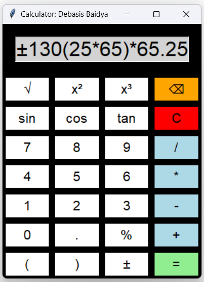

# 🧮 GUI Calculator using Tkinter

---

This is a simple yet powerful calculator app I built using Python and Tkinter. It’s designed to be user-friendly while still offering a range of useful features.

---

## 🔧 Main Features

- ➕ **Basic Math**: You can do addition, subtraction, multiplication, and division.  
- 🧠 **Advanced Functions**: It also handles square roots, trigonometric functions like sin, cos, and tan, and even squares and cubes.  
- 💹 **Percentage Calculations**: The calculator can easily handle percentages, making it great for things like tax or discount calculations.  
- ⚠️ **Error Messages**: If you try to do something that doesn’t make sense, like dividing by zero, the app will let you know with a helpful message.  
- 🎨 **Customizable Look**: The buttons are colorful, and the layout is designed to be clear and easy to use. Plus, you can resize the window as needed.

---

## ⚙️ How It Works

- 🧱 **Built with Tkinter**  
Tkinter handles all the parts you see and interact with, like buttons and the display.

- 🔢 **Math Operations**  
Python’s math module does the heavy lifting for all the calculations.

- 👆 **Button Clicks**  
The `on_button_click()` function is what makes the buttons work, updating the display and calculating results.

---

## 📸 App Preview

  

> Screenshot of the GUI Calculator built with Tkinter.

---

## 📚 Tech Stack

| Category        | Tools / Libraries       |
|----------------|--------------------------|
| Language        | Python                   |
| GUI Framework   | Tkinter                  |
| Math Operations | Python’s `math` module   |
| UX              | Custom buttons, colors   |

---

## 💡 What I Learned

- Creating a clean, interactive user interface with Tkinter  
- Handling real-time input and operations from GUI buttons  
- Managing mathematical exceptions and displaying helpful errors  
- Adding multiple function types while keeping the design intuitive

---

## 🚀 How to Use It

1. Run `GUI Calculator.py` 
2. Click on any button (numbers, operations, functions)  
3. View real-time output on the display  
4. Press `=` to see the final result  
5. Use `C` or `AC` to clear the input anytime

---

## 📬 About Me

**Debasis Baidya**  
Senior MIS | Data Science Intern  
✅ Automated 80%+ of manual processes at my workplace  
📊 Skilled in Python, Power BI, SQL, Google Apps Script, ML, DL, NLP  
📫 Connect: [LinkedIn](https://www.linkedin.com/in/debasisbaidya)

---

> ⭐ If you liked the project, feel free to ⭐ star it and share feedback. Thanks for visiting!
